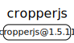
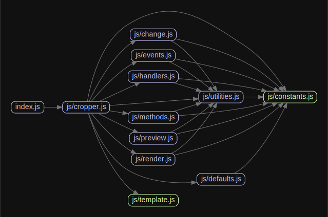

# 源码分析

## 文件结构

``` bash
/Users/liufang/openSource/FunnyLiu/cropperjs
├── CHANGELOG.md
├── LICENSE
├── README.md
├── dist
|  ├── cropper.common.js
|  ├── cropper.css
|  ├── cropper.esm.js
|  ├── cropper.js
|  ├── cropper.min.css
|  └── cropper.min.js
├── docs
|  ├── css
|  |  ├── cropper.css
|  |  └── main.css
|  ├── examples
|  |  ├── a-range-of-aspect-ratio.html
|  |  ├── crop-a-round-image.html
|  |  ├── crop-cross-origin-image.html
|  |  ├── crop-on-canvas.html
|  |  ├── cropper-in-modal.html
|  |  ├── customize-preview.html
|  |  ├── fixed-crop-box.html
|  |  ├── full-crop-box.html
|  |  ├── mask-an-image.html
|  |  ├── minimum-and-maximum-cropped-dimensions.html
|  |  ├── multiple-croppers.html
|  |  ├── one-to-one-crop-box.html
|  |  ├── responsive-container.html
|  |  └── upload-cropped-image-to-server.html
|  ├── images
|  |  ├── data.jpg
|  |  ├── layers.jpg
|  |  ├── picture-2.jpg
|  |  ├── picture-3.jpg
|  |  └── picture.jpg
|  ├── index.html
|  └── js
|     ├── cropper.js
|     └── main.js
├── karma.conf.js
├── package-lock.json
├── package.json
├── postcss.config.js
├── rollup.config.js
├── src
|  ├── css
|  |  ├── cropper.css
|  |  └── cropper.scss
|  ├── images
|  |  └── bg.png
|  ├── index.css
|  ├── index.js
|  ├── index.scss
|  └── js
|     ├── change.js
|     ├── constants.js
|     ├── cropper.js
|     ├── defaults.js
|     ├── events.js
|     ├── handlers.js
|     ├── methods.js
|     ├── preview.js
|     ├── render.js
|     ├── template.js
|     └── utilities.js
└── types
   └── index.d.ts

directory: 15 file: 132

ignored: directory (1)

```

## 外部模块依赖



## 内部模块依赖


  